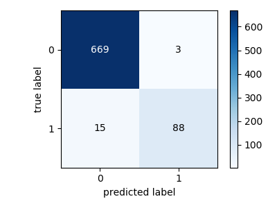
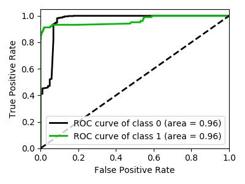

# nlp_ml
[](https://travis-ci.org/pySRURGS/nlp_ml)
[](https://www.python.org/downloads/release/python-360/)

`nlp_ml` is a command line script that performs natural language processing and machine learning of a CSV (comma separated value) file with text data and labels. The CSV file must have the columns 'text' and 'class'. The code randomly generates classification pipelines, performs 10-fold cross validation for assessing model performance on the training dataset, and saves the results to a SQLite database. The code uses the SMOTE oversampler to avoid issues with imbalanced datasets. `nlp_ml` solves supervised binary classification problems using text data. When generating your CSV file, remove commas from the elements of the `text` column prior to saving the file.

## Installation

Install [git](https://git-scm.com/downloads). Run the rest of the commands in git bash.

To download the code:
```
git clone https://github.com/pySRURGS/nlp_ml.git
```
Install the anaconda distribution: [Anaconda3-5.2.0-Windows-x86_64](https://repo.anaconda.com/archive/Anaconda3-5.2.0-Windows-x86_64.exe). Then run 
```
conda install -c conda-forge spacy
```

Then, install the remaining prerequisites.

```
cd nlp_ml
pip install -r requirements.txt --user
```

## Usage

Run the script from within the `nlp_ml` directory.

```
winpty python nlp_ml.py -h
```

Should print 

```
usage: nlp_ml.py [-h] train test iters path_to_db

positional arguments:
  train       absolute or relative file path to the CSV file housing the
              training data
  test        absolute or relative file path to the CSV file housing the
              testing data
  iters       the number of classifiers to be attempted in this run
  path_to_db  absolute or relative file path to the output sqlite database

optional arguments:
  -h, --help  show this help message and exit
```

### An example

```
winpty python nlp_ml.py ./spam_data/SMSSpamCollection_train.csv ./spam_data/SMSSpamCollection_test.csv 4 ./spam_data.db
```

Which, after some messages regarding the status of computations, should print out the following.

```
_train_accuracy    _train_precision    _train_recall    _test_accuracy    _test_precision    _test_recall
-----------------  ------------------  ---------------  ----------------  -----------------  --------------
         0.994943            0.992807         0.997111          0.970323           0.877358        0.902913
         0.992054            0.988292         0.995907          0.974194           0.88785         0.92233
         0.972791            0.982077         0.963159          0.965161           0.872549        0.864078
         0.925716            0.990022         0.860101          0.944516           0.894737        0.660194

```

### Figures

Figures are output into the `figures` directory.

 <br> Fig. 1: Sample Confusion Matrix <br><br><br>
 <br> Fig. 2: Sample Learning Curve <br><br><br>
 <br> Fig. 3: Sample Receiver Operating Curve Area Under Curve


## Author
Sohrab Towfighi


## License
This project is licensed under the GPL 3.0 License - see the [LICENSE](LICENSE) file for details
